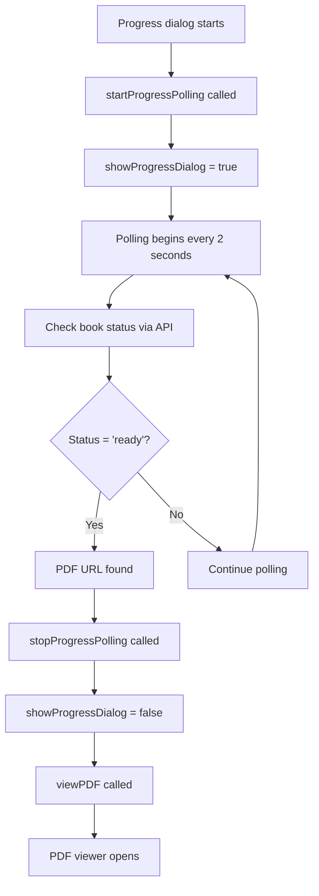
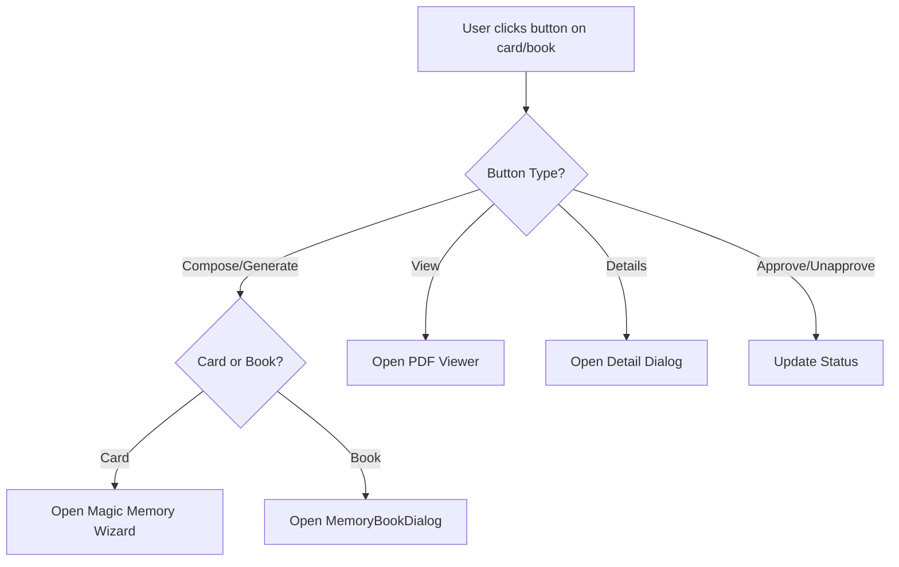
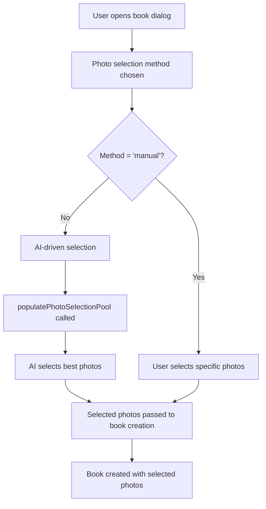

# Memory Books Page Flow Documentation

This document explains the complex flow and architecture of the `/app/memory-books` page, including all components, reactive variables, events, and interactions.

## 🏗️ Page Architecture Overview

The memory-books page (`pages/app/memory-books/index.vue`) is a complex Vue 3 component that orchestrates multiple composables, components, and reactive state to provide a comprehensive memory book management interface.

### Key Components
- **Main Page**: `pages/app/memory-books/index.vue` (2,142 lines)
- **Progress Dialog**: `components/ProgressDialog.vue` (shared with magic wizard)
- **Memory Book Dialog**: `components/MemoryBookDialog.vue`
- **PDF Viewer**: `components/PdfViewer.vue`
- **Memory Book Card**: `components/MemoryBook.vue`

### Core Composables
- `useMemoryStudio()` - Studio state management
- `useMemoryStudioUI()` - UI state management  
- `useMemoryBookOperations()` - Book operations
- `useProgressDialog()` - Progress dialog state
- `usePhotoSelection()` - Photo selection logic

## 🔄 Reactive State Management

### Primary State Variables

```javascript
// Studio state
const { 
  memoryBooks, 
  loadMemoryBooks, 
  getFirstAssetThumbnail,
  getStatusSeverity,
  loadAssetThumbnails 
} = useMemoryStudio()

// UI state
const {
  activeView,
  showCreateModal,
  selectedPhotosForMemoryBook,
  showApprovalDialog,
  showDeleteDialog,
  showMemoryBooksInfoBubble,
  creatingBook,
  pendingApprovalBookId,
  bookToDelete,
  closeCreateModal,
  resetCreateModal
} = useMemoryStudioUI()

// Progress dialog state
const {
  showProgressDialog,
  currentProgress,
  currentProgressMessage,
  isRegenerating,
  startProgressPolling,
  stopProgressPolling,
  generatePDF
} = useProgressDialog()

// Book operations
const {
  createMemoryBook,
  generateMemoryBookPDF,
  viewPDF,
  showPdfModal,
  pdfBlobUrl,
  sharePdf
} = useMemoryBookOperations()
```

### Dialog State Variables

```javascript
// Dialog visibility states
const showDetailsModal = ref(false)
const showGenerateDialog = ref(false)
const showRegenerateDialog = ref(false)
const showUploadDialog = ref(false)

// Selected items
const selectedBook = ref(null)
const pendingBook = ref(null)
const bookToRegenerate = ref(null)
```

### PDF Viewer State

```javascript
const isChrome = ref(false)
const currentPage = ref(1)
const totalPages = ref(1)
const pdfScale = ref(1)
const pdfRotation = ref(0)
```

## 🎯 Core User Flows

### 1. Memory Book Creation Flow

```mermaid
graph TD
    A[User clicks "Create Memory Book"] --> B[MemoryBookDialog opens]
    B --> C[User configures book settings]
    C --> D[User selects photos or uses AI selection]
    D --> E[Dialog submits with book data]
    E --> F[createMemoryBookFromDialog called]
    F --> G[createMemoryBook API call]
    G --> H[Book created in database]
    H --> I[Progress dialog shows]
    I --> J[generateMemoryBookPDF called]
    J --> K[AI photo selection]
    K --> L[PDF generation]
    L --> M[Progress dialog closes]
    M --> N[PDF viewer opens]
```

### 2. Progress Dialog Flow



### 3. Card/Book Button Event Flow

The memory-books page now provides unified button behavior between memory cards and memory books, with smart routing based on the item type:



**Key Differences:**
- **Memory Cards**: Edit/revise operations open the Magic Memory Wizard
- **Memory Books**: Edit/revise operations open the MemoryBookDialog
- **All Other Operations**: View, Details, Approve/Unapprove work identically
- **Same Progress Dialog**: Both use the shared ProgressDialog component
- **Same Status Logic**: Both use identical polling and status update logic

### 4. Photo Selection Flow



## 🔧 Component Interactions

### MemoryBookDialog Component

**Props:**
- `visible` - Dialog visibility
- `initialSelectedAssets` - Pre-selected assets
- `initialPhotoSelectionMethod` - Selection method

**Events:**
- `@close` - Dialog close
- `@submit` - Form submission with book data

**Internal State:**
- Form data (title, layout, page count, etc.)
- Selected assets array
- Photo selection method
- Validation state

### ProgressDialog Component

**Props:**
- `showProgressDialog` - Visibility state
- `currentProgress` - Progress percentage (0-100)
- `currentProgressMessage` - Status message
- `isRegenerating` - Whether regenerating existing book

**Features:**
- Animated progress bar
- Status message updates
- Auto-closes when PDF ready
- Shared with magic wizard

### PdfViewer Component

**Props:**
- `pdfUrl` - PDF file URL
- `visible` - Modal visibility
- `bookId` - Associated book ID

**Features:**
- PDF rendering with PDF.js
- Zoom and pan controls
- Page navigation
- Download functionality
- Mobile-responsive design

## 📡 Event System

### Custom Events

```javascript
// Memory book events
$emit('memory-book-created', bookData)
$emit('memory-book-updated', bookData)
$emit('view-pdf', { bookId, pdfUrl })

// Dialog events
$emit('close-create-modal')
$emit('reset-create-modal')

// PDF events
$emit('pdf-modal-closed')
$emit('pdf-loaded', { totalPages })
```

### Event Listeners

```javascript
// Listen for book updates
onMounted(() => {
  // Reload books when updated
  window.addEventListener('memory-book-updated', loadMemoryBooks)
  
  // Handle PDF viewing
  window.addEventListener('view-pdf', handleViewPDF)
})
```

## 🔄 API Integration

### Memory Book Operations

```javascript
// Create memory book
const createMemoryBook = async (bookData) => {
  const response = await $fetch('/api/memory-books/create', {
    method: 'POST',
    body: bookData
  })
  return response
}

// Generate PDF
const generateMemoryBookPDF = async (bookId) => {
  const response = await $fetch(`/api/memory-books/generate-pdf/${bookId}`, {
    method: 'POST'
  })
  return response
}

// Get book status
const getBookStatus = async (bookId) => {
  const response = await $fetch(`/api/memory-books/status/${bookId}`)
  return response
}
```

### Photo Selection API

```javascript
// AI photo selection
const selectPhotos = async (bookId, photoCount, prompt) => {
  const response = await $fetch('/api/ai/magic-memory', {
    method: 'POST',
    body: {
      memoryBookId: bookId,
      userId: user.id,
      photoCount: photoCount,
      prompt: prompt
    }
  })
  return response
}
```

## 🎨 UI State Management

### View States

```javascript
// Active view (grid/list)
const activeView = ref('grid')

// Pagination
const currentPage = ref(1)
const itemsPerPage = ref(12)
const totalPages = computed(() => Math.ceil(memoryBooks.value.length / itemsPerPage.value))
```

### Filter States

```javascript
// Book status filters
const statusFilter = ref('all')
const statusOptions = [
  { label: 'All Books', value: 'all' },
  { label: 'Draft', value: 'draft' },
  { label: 'Ready', value: 'ready' },
  { label: 'Approved', value: 'approved' }
]
```

### Loading States

```javascript
// Loading indicators
const creatingBook = ref(false)
const loadingBooks = ref(false)
const generatingPDF = ref(false)
```

## 🔄 Reactive Computed Properties

### Filtered Books

```javascript
const filteredBooks = computed(() => {
  let filtered = memoryBooks.value
  
  // Status filter
  if (statusFilter.value !== 'all') {
    filtered = filtered.filter(book => book.status === statusFilter.value)
  }
  
  // Search filter
  if (searchQuery.value) {
    filtered = filtered.filter(book => 
      book.title.toLowerCase().includes(searchQuery.value.toLowerCase())
    )
  }
  
  return filtered
})
```

### Paginated Books

```javascript
const paginatedBooks = computed(() => {
  const start = (currentPage.value - 1) * itemsPerPage.value
  const end = start + itemsPerPage.value
  return filteredBooks.value.slice(start, end)
})
```

## 🎯 Key Functions

### Book Creation Flow

```javascript
const createMemoryBookFromDialog = async (formData) => {
  try {
    // Validate form data
    if (!formData.title || !formData.layout_type) {
      throw new Error('Missing required fields')
    }
    
    // Create book
    const newBook = await createMemoryBook(formData)
    
    // Show progress dialog
    showProgressDialog.value = true
    currentProgressMessage.value = '🎯 Starting memory book generation...'
    currentProgress.value = 0
    
    // Generate PDF
    await generateMemoryBookPDF(newBook.id)
    
  } catch (error) {
    console.error('Error creating memory book:', error)
    showProgressDialog.value = false
  }
}
```

### Progress Polling

```javascript
const startProgressPolling = (bookId, isRegenerating = false) => {
  currentBookId.value = bookId
  isRegenerating.value = isRegenerating
  showProgressDialog.value = true
  
  // Start polling every 2 seconds
  progressInterval.value = setInterval(async () => {
    await pollPdfStatus()
  }, 2000)
}

const pollPdfStatus = async () => {
  const status = await getBookStatus(currentBookId.value)
  
  if (status.book_status === 'ready' && status.pdf_url) {
    // PDF is ready
    stopProgressPolling()
    showProgressDialog.value = false
    viewPDF(status.pdf_url)
  }
}
```

## 🎨 Styling and Theming

### Tailwind CSS Classes

```css
/* Main container */
.memory-books-page {
  @apply min-h-screen bg-gradient-to-br from-brand-navigation/5 via-brand-accent/5 to-brand-highlight/5;
}

/* Book grid */
.book-grid {
  @apply grid grid-cols-1 sm:grid-cols-2 lg:grid-cols-3 xl:grid-cols-4 gap-6;
}

/* Book card */
.book-card {
  @apply bg-white rounded-2xl shadow-lg border border-gray-100 overflow-hidden;
}

/* Status badges */
.status-draft {
  @apply bg-yellow-100 text-yellow-800;
}

.status-ready {
  @apply bg-green-100 text-green-800;
}

.status-approved {
  @apply bg-blue-100 text-blue-800;
}
```

### Responsive Design

```css
/* Mobile-first approach */
@media (max-width: 640px) {
  .book-grid {
    @apply grid-cols-1 gap-4;
  }
  
  .book-card {
    @apply rounded-xl;
  }
}

@media (min-width: 1024px) {
  .book-grid {
    @apply grid-cols-4 gap-8;
  }
}
```

## 🔧 Error Handling

### Try-Catch Blocks

```javascript
const createMemoryBookFromDialog = async (formData) => {
  try {
    // Book creation logic
  } catch (error) {
    console.error('Error creating memory book:', error)
    
    // Show user-friendly error message
    toast.add({
      severity: 'error',
      summary: 'Error',
      detail: 'Failed to create memory book. Please try again.',
      life: 5000
    })
    
    // Reset state
    showProgressDialog.value = false
    creatingBook.value = false
  }
}
```

### Validation

```javascript
const validateBookData = (data) => {
  const errors = []
  
  if (!data.title || data.title.trim().length === 0) {
    errors.push('Title is required')
  }
  
  if (!data.layout_type) {
    errors.push('Layout type is required')
  }
  
  if (data.page_count && (data.page_count < 1 || data.page_count > 10)) {
    errors.push('Page count must be between 1 and 10')
  }
  
  return errors
}
```

## 🚀 Performance Optimizations

### Lazy Loading

```javascript
// Lazy load PDF viewer
const PdfViewer = defineAsyncComponent(() => 
  import('~/components/PdfViewer.vue')
)

// Lazy load memory book dialog
const MemoryBookDialog = defineAsyncComponent(() => 
  import('~/components/MemoryBookDialog.vue')
)
```

### Debounced Search

```javascript
const searchQuery = ref('')
const debouncedSearch = debounce((query) => {
  // Perform search
}, 300)

watch(searchQuery, (newQuery) => {
  debouncedSearch(newQuery)
})
```

### Memoized Computed Properties

```javascript
const expensiveComputation = computed(() => {
  // Expensive operation that only runs when dependencies change
  return memoryBooks.value
    .filter(book => book.status === 'ready')
    .map(book => ({
      ...book,
      thumbnail: getFirstAssetThumbnail(book.id)
    }))
})
```

## 🔍 Debugging and Development

### Console Logging

```javascript
// Debug logging for development
if (process.env.NODE_ENV === 'development') {
  console.log('🔧 [createMemoryBookFromDialog] Starting with data:', formData)
  console.log('🔧 [createMemoryBookFromDialog] Validation passed')
  console.log('🔧 [createMemoryBookFromDialog] Book created successfully')
}
```

### Development Tools

```javascript
// Vue DevTools integration
const debugState = () => {
  console.log('Current state:', {
    memoryBooks: memoryBooks.value.length,
    activeView: activeView.value,
    showProgressDialog: showProgressDialog.value,
    currentProgress: currentProgress.value
  })
}
```

## 📱 Mobile Responsiveness

### Mobile-First Design

```css
/* Base mobile styles */
.memory-books-page {
  @apply px-4 py-6;
}

.book-grid {
  @apply grid-cols-1 gap-4;
}

/* Tablet styles */
@media (min-width: 768px) {
  .memory-books-page {
    @apply px-6 py-8;
  }
  
  .book-grid {
    @apply grid-cols-2 gap-6;
  }
}

/* Desktop styles */
@media (min-width: 1024px) {
  .memory-books-page {
    @apply px-8 py-10;
  }
  
  .book-grid {
    @apply grid-cols-3 gap-8;
  }
}
```

### Touch Interactions

```javascript
// Touch-friendly interactions
const handleTouchStart = (event) => {
  // Handle touch start
}

const handleTouchEnd = (event) => {
  // Handle touch end
}
```

## 🔄 State Synchronization

### Cross-Component Communication

```javascript
// Event bus for cross-component communication
const eventBus = useEventBus()

// Emit events
eventBus.emit('memory-book-created', bookData)
eventBus.emit('memory-book-updated', bookData)

// Listen for events
eventBus.on('memory-book-created', (bookData) => {
  // Handle book creation
  loadMemoryBooks()
})
```

### Reactive State Updates

```javascript
// Watch for changes and update UI
watch(memoryBooks, (newBooks) => {
  // Update UI when books change
  updateBookGrid()
}, { deep: true })

watch(showProgressDialog, (isVisible) => {
  // Handle progress dialog visibility
  if (isVisible) {
    document.body.style.overflow = 'hidden'
  } else {
    document.body.style.overflow = 'auto'
  }
})
```

## 🎯 Best Practices

### Code Organization

1. **Composables**: Extract reusable logic into composables
2. **Components**: Keep components focused and single-purpose
3. **State Management**: Use reactive refs for local state
4. **Event Handling**: Use consistent event naming
5. **Error Handling**: Always wrap async operations in try-catch

### Performance

1. **Lazy Loading**: Use `defineAsyncComponent` for heavy components
2. **Debouncing**: Debounce user input for search and filters
3. **Memoization**: Use computed properties for expensive operations
4. **Virtual Scrolling**: Consider for large lists
5. **Image Optimization**: Lazy load images and use appropriate sizes

### Accessibility

1. **ARIA Labels**: Add proper ARIA labels to interactive elements
2. **Keyboard Navigation**: Ensure all functionality is keyboard accessible
3. **Screen Reader Support**: Use semantic HTML and proper headings
4. **Focus Management**: Manage focus for modals and dialogs
5. **Color Contrast**: Ensure sufficient color contrast

This comprehensive documentation covers the complex flow and architecture of the memory-books page, providing developers with a clear understanding of how all the components, reactive variables, and events work together to create a seamless user experience.
